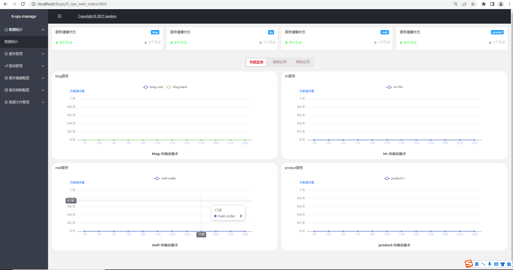
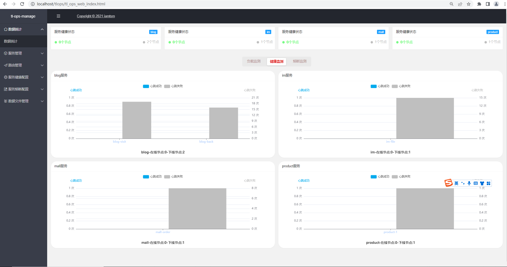
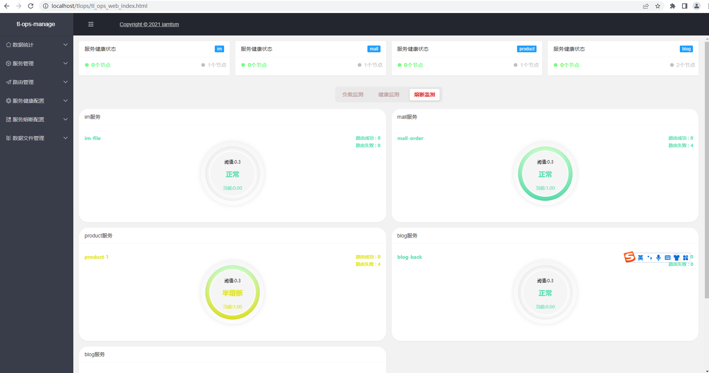

# tl-ops-manage (tl openresty lua manage)

体验demo : https://tlops.iamtsm.cn/tlops/tl_ops_web_index.html

#### 欢迎有兴趣的童鞋提交RP, 持续更新中 ....

**qq交流群 : 624214498**

[EN DOC](doc/README_EN.md) 

# 基于openresty的轻量级服务管理功能集合实现

## 规划 / 进度

- [x] 支持API规则负载

- [x] 支持服务健康检查

- [x] 支持服务限流熔断

- [x] 支持动态增量配置

- [x] 支持动态节点扩展

- [x] 支持配置数据持久

- [x] 支持管理操作界面

- [x] 支持域名路由负载

- [x] 支持令牌桶流控

- [x] 支持变更路由策略

- [x] 支持自定义回包码

- [x] 支持cookie负载

- [x] 支持请求参数负载

- [ ] 支持实时服务监控

- [ ] 支持漏桶流控选项

- [ ] 支持配置动态删除

- [ ] 支持持久数据管理

- [ ] 支持配置发布回滚

- [ ] 支持服务灰度标签

- [ ] 支持服务告警通知

- [ ] 支持ShareDict展示台

- [ ] 支持手动管理健康检查器

- [ ] 支持健康检查历史数据统计

- [ ] 支持查看健康检查节点日志

- [ ] 支持查看熔断限流节点日志

- [ ] 支持查看路由负载节点日志

- [ ] 管理端界面/请求优化

- [ ] 分离管理端项目

## 使用方式

### 1. 安装环境

安装openresty，安装redis

### 2. 修改配置

nginx.conf引入本项目lua包  `lua_package_path "/xxx/tl-ops-manage/?.lua;;"`

修改nginx.conf引入/conf/tl_ops_manage.conf  `include "/xxx/tl-ops-manage/conf/*.conf;"`

修改tl_ops_manage.conf中的路径

修改/constant/tl_ops_constant_log.lua中的路径

### 3. 启动nginx/openresty

如果是首次启动，先访问 `http://127.0.0.1/tlops/reset` 初始化项目

http://localhost/tlops/tl_ops_web_index.html  管理后台

## 说明文档

- [x] [详细使用说明文档](https://blog.iamtsm.cn/detail.html?id=90)

- [x] [源码实现说明文档](https://blog.iamtsm.cn/detail.html?id=91)

- [x] [路由模块简要文档](doc/tl-ops-balance.md)

- [x] [健康检查模块简要文档](doc/tl-ops-health.md)

- [x] [熔断限流模块简要文档](doc/tl-ops-limit.md)

- [x] [数据模块简要文档](doc/tl-ops-store.md)

## 事务日程

2022-05-28

    1. 路由负载配置统一化

    2. 支持cookie负载规则

    3. 支持请求参数负载规则

    4. 优化管理端样式图标

    5. 支持路由配置删除

    6. 优化路由默认配置

    7. 优化重复请求

    8. 事务日程规划调整

    9. fix bugs

2022-05-26

    1. 支持健康检查成功状态自定义
    
    2. 即将支持sharedDict管理

    3. 支持实时切换路由负载策略

    4. 配置说明、管理端文案调整优化

    5. 事务日程规划调整

    5. fix bugs

2022-05-25

    1. 优化管理端请求

    2. 修复单个时间变动的bug

    3. 修复添加数据时多余字段

    4. 修复可添加重复服务名称

    5. 补充部分说明文档

    6. fix bugs

2022-05-24

    1. 支持域名负载

    2. 路由负载令牌桶流控接入

    3. 优化不同系统下的路径问题

    4. 优化多余代码

    5. 补充部分说明文档

    6. fix bugs

2022-05-19

    1. 移除配置示例数据，提供DEMO数据

    2. 支持实时修改检查时间间隔

    3. 优化管理端展示

    4. 优化配置不同步的问题

    5. 补充部分说明文档

    6. fix bugs

2022-05-18

    1. 支持熔断限状态概览

    2. 支持熔断限流动态配置文件同步

    3. 路由负载优化

    4. 补充部分说明文档

    5. fix bugs

2022-02-28

    1. 支持部分熔断限流动态配置文件

    2. 拆分路由，服务，节点模块

    3. 支持查看持久化store数据文件

    4. 补充部分说明文档

    5. fix bugs

2022-02-18

    1. 支持熔断限流（支持令牌桶限流）

    2. 管理后台优化

    3. 路由负载优化

    4. 健康检查优化

    5. 补充部分说明文档

    6. fix bugs

2022-01-15

    1. 补充api

    2. 优化代码

    3. 优化体验

    4. 优化负载模块

    5. 完善熔断限流部分模块

2022-01-11

    1. 健康检查支持动态配置加载

    2. 支持路由负载配置管理

    3. 支持健康检查配置管理

    4. 支持管理控制台服务概览

    5. 优化路由负载模块

2021-12-22

    1. 初始化项目

## 引用致谢

#### [openresty](https://github.com/openresty/openresty)

#### [layui](https://github.com/layui/layui)

#### [iredis](https://github.com/membphis/lua-resty-iredis)

#### [snowflake](https://github.com/yunfengmeng/lua-resty-snowflake)

#### [echarts](https://github.com/apache/echarts)

## 开源协议

#### Apache License 2.0