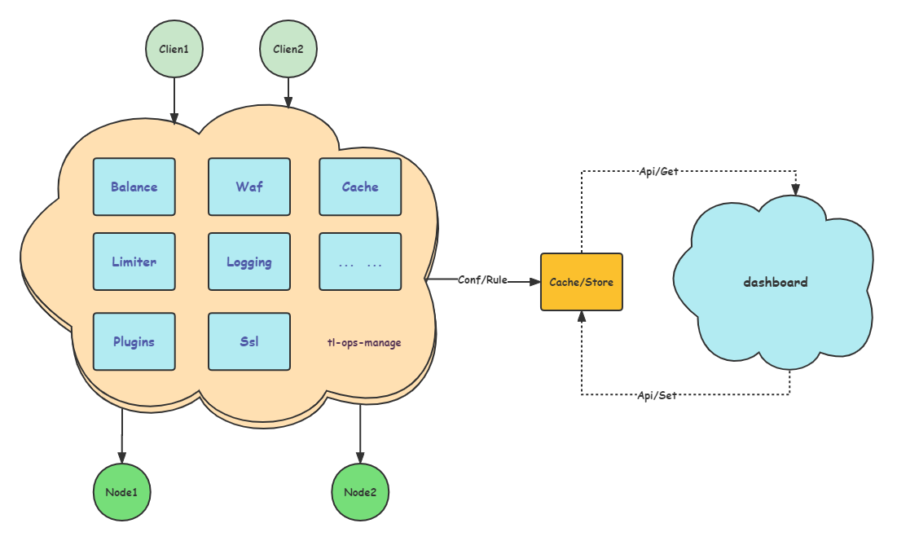

   

API gateway based on openresty, supports load balancing, registration discovery, health check, service fuse, service current limit, waf filtering, black and white list, dynamic configuration, data statistics, data display

---

Experience demo : https://tlops.iamtsm.cn/tlopsmanage/tl_ops_web_index.html

QQ : 624214498, welcome to submit PR, we will continue to update ....

<a href="https://github.com/iamtsm/tl-ops-manage/blob/main/README.md"> 中文翻译 </a>

# Detailed documentation

[tl-ops-manage-documentation](https://book.iamtsm.cn)

# Features

- [x] [FEATURE-LOG](feature.md)

# Update log

- [x] [UPDATE-LOG](change.md)

# Thanks

#### [openresty](https://github.com/openresty/openresty)

#### [layui](https://github.com/layui/layui)

#### [iredis](https://github.com/membphis/lua-resty-iredis)

#### [snowflake](https://github.com/yunfengmeng/lua-resty-snowflake)

#### [echarts](https://github.com/apache/echarts)

# License

#### Apache License 2.0