      __  .__                                                                                       
    _/  |_|  |             ____ ______  ______           _____ _____    ____ _____     ____   ____  
    \   __\  |    ______  /  _ \\____ \/  ___/  ______  /     \\__  \  /    \\__  \   / ___\_/ __ \ 
    |  | |  |__  /_____/ (  <_> )  |_> >___ \  /_____/ |  Y Y  \/ __ \|   |  \/ __ \_/ /_/  >  ___/ 
    |__| |____/           \____/|   __/____  >         |__|_|  (____  /___|  (____  /\___  / \___  >
                                |__|       \/                \/     \/     \/     \//_____/      \/ 
# Service management framework based on openresty （API Gateway）

[](https://openresty.org/cn/)
[](https://github.com/iamtsm/tl-ops-manage)
[](https://github.com/iamtsm/tl-ops-manage/blob/main/doc/tl-ops-health.md)
[](https://github.com/iamtsm/tl-ops-manage/blob/main/doc/tl-ops-balance.md)
[](https://github.com/iamtsm/tl-ops-manage/blob/main/doc/tl-ops-balance.md)
[](https://github.com/iamtsm/tl-ops-manage)


Experience demo : https://tlops.iamtsm.cn/tlops/tl_ops_web_index.html


**QQ : 624214498, welcome to submit PR, we will continue to update ....**


<p align="center"> <a href="https://github.com/iamtsm/tl-ops-manage/blob/main/doc/README_EN.md"> EN </a> | <a href="https:// github.com/iamtsm/tl-ops-manage#readme"> ZN </a> </p>  


| Web | Manage | UI | Preview |
|:-------------:|:-------:|:-------:|:-------:|
| 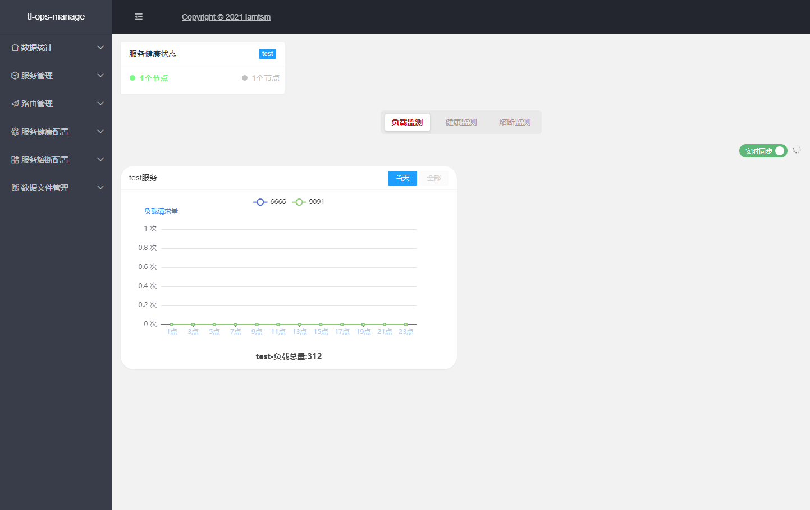 | 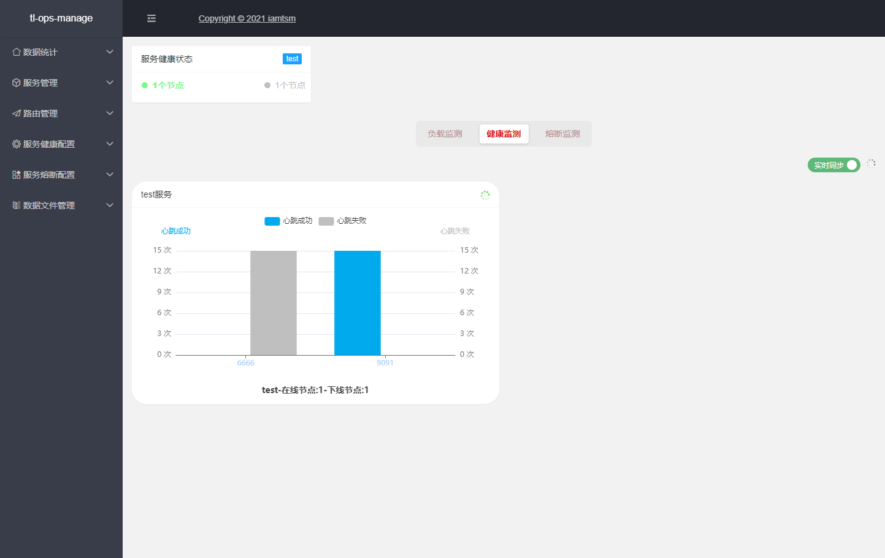 | 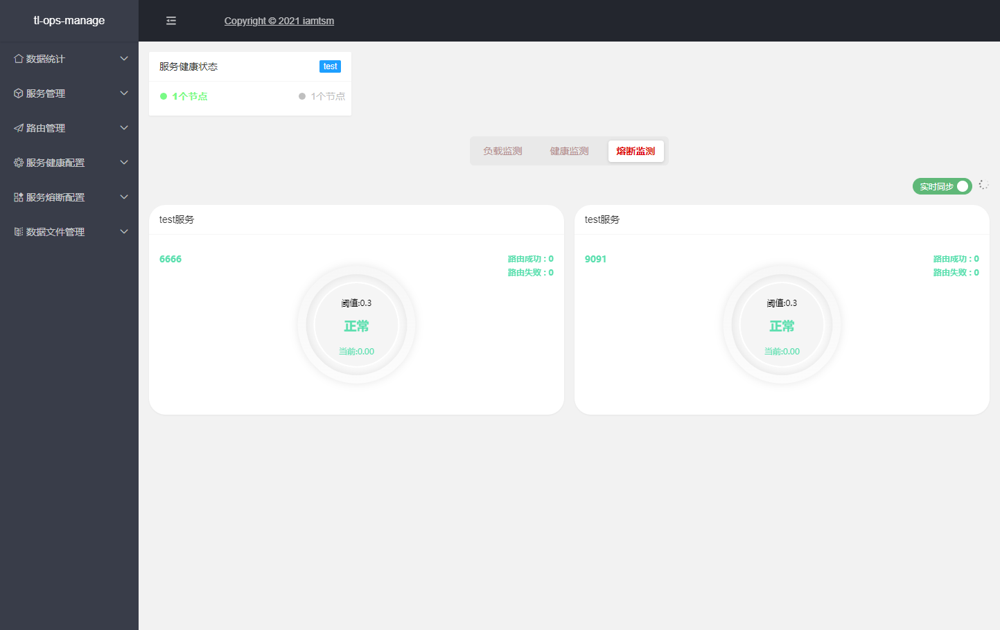 |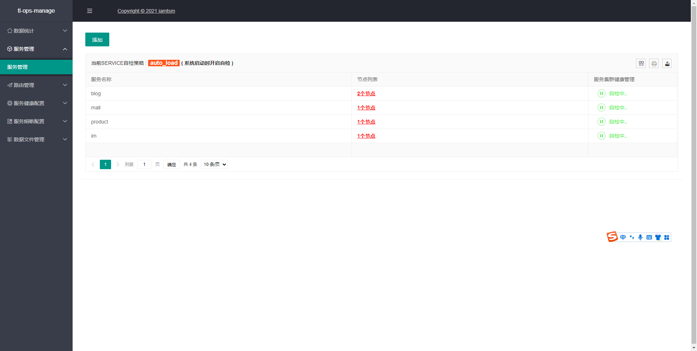
|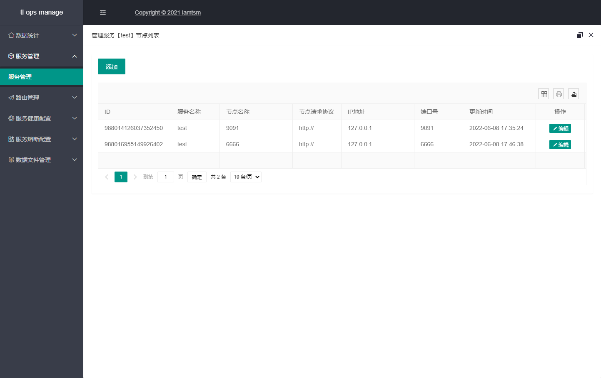 |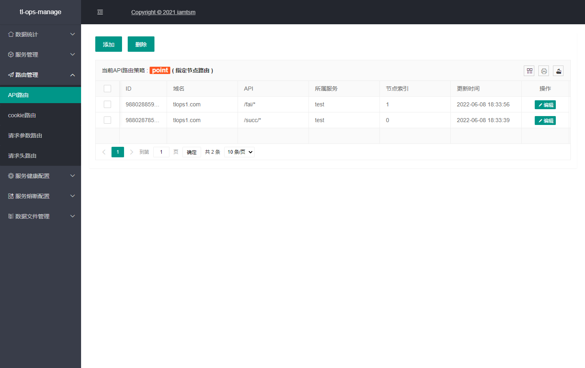|  | 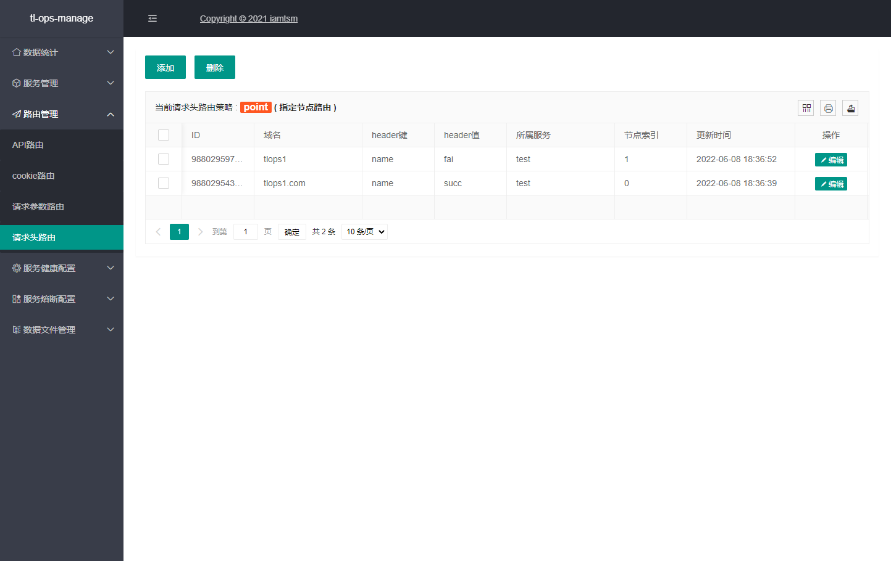
|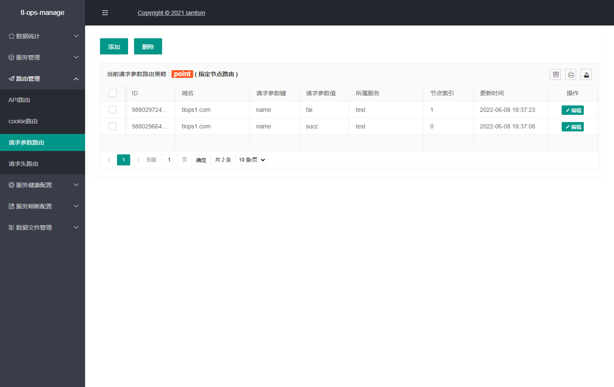|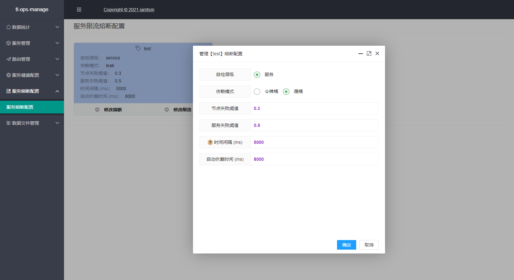|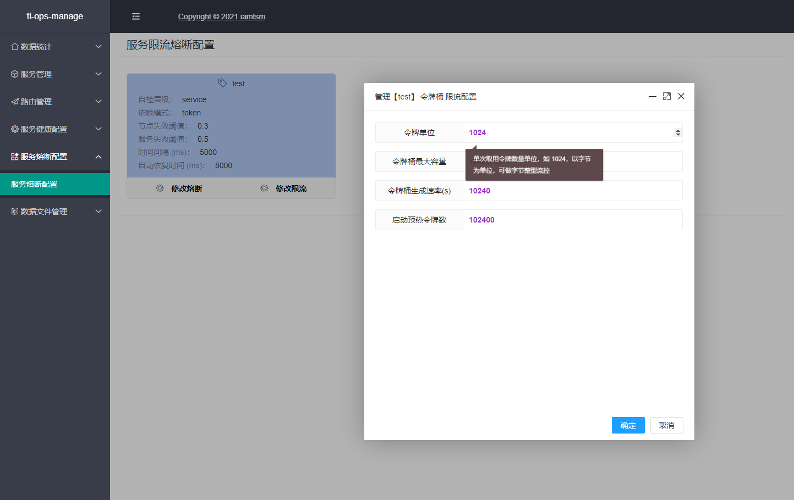|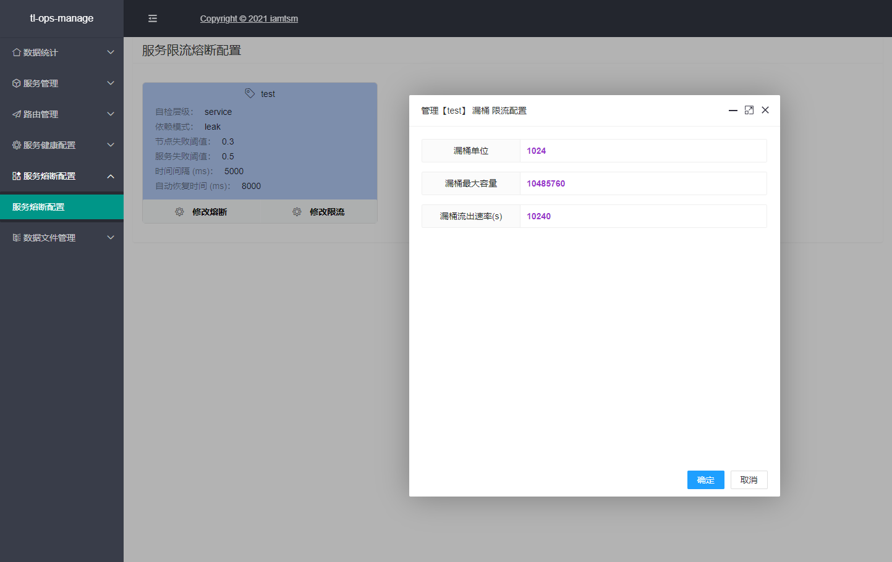
|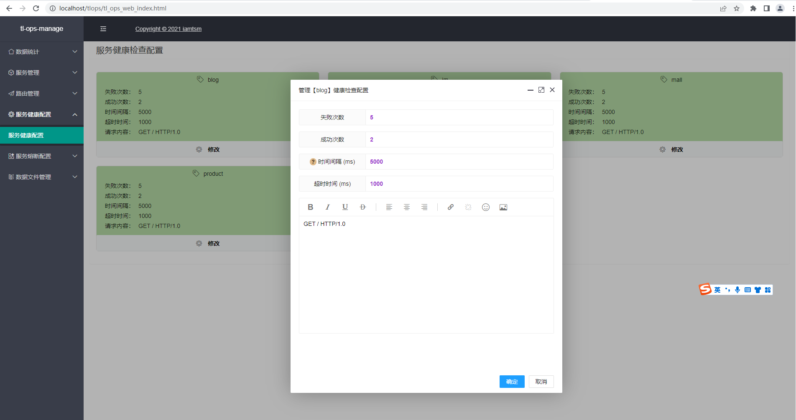|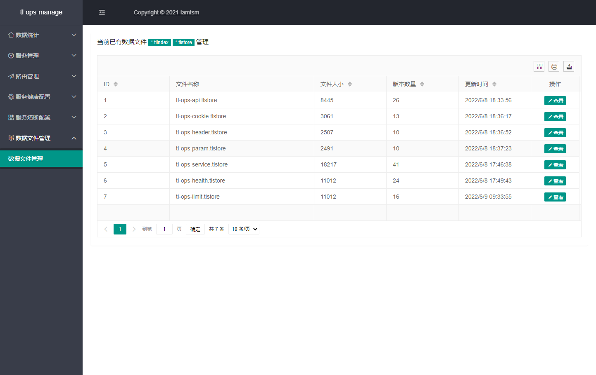|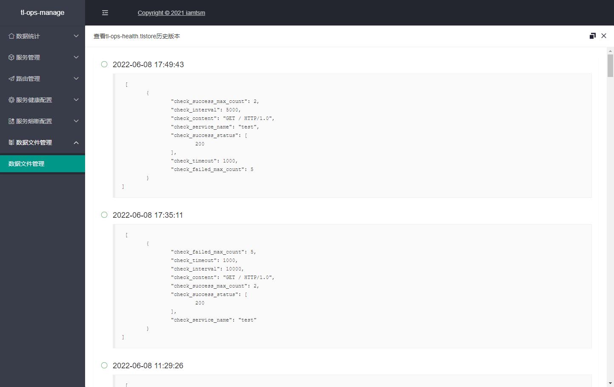


# Features

- [x] Support API rule load

- [x] Support cookie payload

- [x] Support header payload

- [x] Support request parameter payload

- [x] Support domain name routing payload

- [x] Support bulk routing strategy

- [x] Support dynamic routing strategy

- [x] Support routing configuration management


- [x] Support service health check

- [x] Support custom return code

- [x] Support pausing health check

- [x] Support for adjusting health status


- [x] Support service fuse current limiting

- [x] support token bucket current limiter

- [x] Support token bucket warm-up

- [x] Support leaky bucket restrictor

- [x] Support for dynamically changing current limiter

- [x] Support current limiter configuration management

- [x] Support circuit breaker policy adjustment


- [x] Support configuration data persistence

- [x] Support dynamic node expansion

- [x] Support dynamic incremental configuration

- [x] Support management interface

- [x] Support real-time service monitoring

- [x] Support multi-level log generation


- [ ] Support custom WAF policy

- [ ] Support cc prevention rules

- [ ] Support IP black and white list rules

- [ ] Support Url black and white list rules

- [ ] Support Cookie black and white list rules

- [ ] Support parameter black and white list rules

- [ ] Support Header black and white list rules


- [ ] Support configuring grayscale publishing

- [ ] Support permission identity control

- [ ] Support the introduction of plug-in secondary development

- [x] Support version iteration data synchronization

- [ ] Support cluster deployment data synchronization
 
- [ ] Support docker one-click deployment

- [ ] Support multi-language management interface


- [ ] Support health check log analysis

- [ ] Supports circuit breaker current limiting log analysis

- [ ] Support routing load log analysis


# How to use

## 1. Installation environment

install openresty

## 2. Modify the configuration

- Copy the following two lines into nginx.conf into the http block

    ````
    http {
        ...
        # Import tl_ops_manage.conf
        include "/path/to/tl-ops-manage/conf/*.conf;

        # import lua package
        lua_package_path "/path/to/tl-ops-manage/?.lua;;"
        ...
    }
    ````

- Modify the path in the /path/to/tl-ops-manage/conf/tl_ops_manage.conf file

- Modify the path in the /path/to/tl-ops-manage/constant/tl_ops_manage_env.lua file

- Since redis is enabled by default, you need to install redis. If you don't want to use redis, you can set the redis option to false in tl_ops_manage_env.lua


## 3. Start nginx/openresty

visit http://your-domain/tlops/tl_ops_web_index.html management background


## 4. Version update or first use

visit http://your-domain/tlops/sync for init project / sync version update data


# Documentation

- [x] [Detailed instruction document](https://blog.iamtsm.cn/detail.html?id=90)

- [x] [Source code implementation documentation](https://blog.iamtsm.cn/detail.html?id=91)

- [x] [Brief documentation of routing module](doc/tl-ops-balance.md)

- [x] [Brief Documentation of Health Check Module](doc/tl-ops-health.md)

- [x] [Brief Documentation of Fusing Current Limiting Module](doc/tl-ops-limit.md)

- [x] [Data Module Brief Documentation](doc/tl-ops-store.md)


# Change log

- [x] [CHNAGE-LOG](doc/change.md)


# Thanks

#### [openresty](https://github.com/openresty/openresty)

#### [layui](https://github.com/layui/layui)

#### [iredis](https://github.com/membphis/lua-resty-iredis)

#### [snowflake](https://github.com/yunfengmeng/lua-resty-snowflake)

#### [echarts](https://github.com/apache/echarts)


# License

#### Apache License 2.0